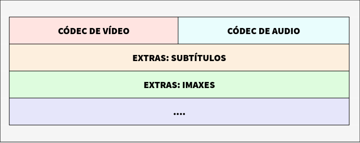

# Imagenes Conceptos

`pixels` = unidad de visualizacion mas pequeña de una imagen digital.

`Resolucion de imagen` = grado de detalle o calidad de una imagen digital. (ppp/ppi)

`Resolucion de un monitor` = numero de pixeles por pulgada capaz de mostrar

`Profundidad de color` = numero de bits necesarios para codificar y almacenar información de color de cada píxel de una imagen. **(+bits = +colores)**


## Modos de color

- **Monocromático**: 1 bit = blanco/negro

- **Escala de grises**: 256 tonos de grises

- **Color indexado**: 8 bit = 256 colores(2*)

- **RGB**: combinacion de 3 valores `(ROJO, VERDE, AZUL)` (0-255)

- **HSB**: combinacion de 3 valores `(Tono[0-360], Saturación[0%-100%], Brillo[0-100])` 


## Formatos


#### `BMP` (Bitmap)
- windows
- cuadricula de pixeles
- no pierde calidad
- guarda mucha info pero ocupa mucho

#### `GIF` (Graphics Interchange Format)
- especificamente diseñado para comprimir imagenes digitales
- paleta de 256 colores (8bits)
- no recomendada para fotos de cierta calidad o originales
- perfecto para publicar dibujos

#### `JPG-JPEG` (Join Photographic Experts Group)
- 16 millones de colores
- comun para publicar en la web
- Pierde calidad al comprimir `(REC:90%-60%)`
- Formato por defecto de camaras digitales
- Ideal su uso mientras estea bien configurada las dimensiones y la compresión.


#### `TIF-TIFF` (Tagged Image File Format)
- imagenes en excelente calidad
- profundidad de 1 a 32 bits
- Editar o imprimir ideal
- Archivos muy grandes


#### `PNG` (Portable Network Graphic)
- Alternativa de `GIF`
- tasa de compresion mas alta que GIF (+10%)
- Pierde calidad al comprimir `(REC:90%-60%)`
- 64 bits de profundidad = +256 colores
- No tiene perdida en la compresión


#### `SVG` (Scalable Vector Graphics)
- Escalable de manera **ilimitada** sin perdidas
- No compuesto por pixeles, si no de información matematica
- Ideal para gráficas, mapas e iconos
- Puedes animar cada elemento individualmente facilmente al usar matematicas en vez de pixeles
- Animable en el html por JavaScript y CSS 
- Es de **menor tamaño sus ficheros** que los de JPG o PNG


#### `WebP` (especifico para uso web)
- Combina las ventajas de JPG y PNG
- Compatible con la mayotia de navegadores
- Imagenes comprimidas **sin** perdida [26% mas pequeño que PNG]
- Imagenes comprimidas **con** perdida [25-34% mas pequeño que JPEG]
- tienen soporte para transparencias
- Con perdidas y transparencia aumenta su tamaño un 22%


## Optimización WEB

- Imagenes lo menos pesadas posibles
- El tamaño de los archivos graficos son determinados por su dimension, su resolucion, el numero de colores y el formato (JPG, GIF, PNG)
- Imagenes no superiores a `72ppp para webs`, pensando en la mas usada en los ordenadores
-Para **imprimir** se recomienda entre `200-300ppp`
- Se recomienda editar la imagen con un editor para cumplir con las caracteristicas anteriormente dichas.
- Guardar imagenes favoritas en formato BMP, TIFF o JPG sin comprimir, asi creando a partir de ellos copias en formatos PNG, JPG o WebP
- `GIF` para dibujos, graficos y logotipos
- `JPG` para fotos e imagenes con degradados
- No insertar las imagenes con `Ctrl+C` y `Ctrl+V`

# Audio Conceptos


## Formatos

#### `WAV (WaveForm Audio File)`
- Ideal para guardado de originales.
- Gran calidad de audio = **enorme peso**.
- Compresiones [`PCM`, `ADPCM`].

#### `MP3 (MPEG 1 Layer 3)`
- BigDady.
- Ideal para publicar en web.
- Reproducible en la mayoría de reproductores.
- Tanto convertir desde WAV como publicar a MP3 son procesos sencillos.
- **Pérdida mínima de calidad**.

#### `OGG`
- Fundado por *Xiph.org*.
- Alternativa **libre y de código abierto** contra el MP3.
- Calidad de reproducción ligeramente superior a MP3.
- No todos lo pueden reproducir (necesario instalar *codecs o plugins*).
- Capa de audio fomenta el formato Vorbis.

#### `MIDI (Musical Instrument Digital Interface)`
- No digitalizado de un sonido analógico.
- Almacena secuencias de dispositivos MIDI `(Sintetizadores)`.
- Apoyado por los principales reproductores del mercado.
- Utilizado como `música de fondo` de **páginas HTML**.

#### `OTHERS`

| Formato | Descripción |
|----|-------------------------|
| `Real Audio` |Streaming |
| `WMA (Windows Media Audio)` | Microsoft |
| `WAV o WAVE` | Sin compresión (ocupa mucho) |
| `VQF` | Impulsado por Yamaha, tiene mayor calidad y ocupa menos que MP3, pero no está muy extendido |
| `FLAC (Free Lossless Audio)` | Sin pérdida, tamaño reducido < MP3.tamaño, licencia libre y formato abierto |

## Herramientas

| `FreeStudio` | `Audicity` | `Bearaudio Tool` | `VideoLAN` | `Convertidor de audio Online` |
|----|----|----|----|----|


## Repositorios `(VER PAGINA CENTRO)`


## Optimizar ficheros de audio

- `Tasa de mostraxe` = 44100 Hz, 22050 Hz, 11025 Hz, etc.

- `Resolución` = 32 bits, 16 bits, 8 bits, 4 bits, etc.

- `Duración` = .Fragmentos mas cortos reproducidos en bucle `[loop]` para cubrir el tiempo suficiente al acompañamiento musical

- `Calidad estereo/modo` = La reducción de la calidad a "mono" reduce considerablemente el tamaño del archivo. Por otro lado, la calidad de reproducción "mono" en ocasiones es válida, pero cuando se busca una experiencia sonora más rica, la opción "estéreo" es preferible.

- `Formato` = Preferible uso de **MP3 o OGG** antes que **WAV**.


# Video Digital Conceptos

#### `Dimensións`
- Tamaño do vídeo (**ancho x alto**) en píxeles ao 100%.
- Ampliar ou reducir (ex. 200%) diminúe a **calidade**.
- Formato `AVI` permite calquera **ancho e alto**.

#### `Códec`
- **Algoritmo** que reduce o tamaño do ficheiro de vídeo.
- Necesita o mesmo códec para **codificar** e **descodificar**.
- Códecs populares: `AVI`, `H.265`, `H.264`, `MPEG-4`, `DivX`, `XviD`, etc.

#### `Velocidade de transmisión (bitrate)`
- Cantidade de espazo (**bits**) que ocupa un segundo de vídeo.
- Máis **bitrate** = máis **calidade** e maior **peso** do ficheiro.
- **Bitrate variable** adapta a calidade segundo as escenas (máis detalle en acción, menos en estáticas).

#### `Fotogramas por segundo (fps)`
- Número de imaxes mostradas por segundo.
- Valor común: **24-30 fps** (ex. DVD en Europa: **25 fps**).

#### `Fotogramas clave`
- Na **compresión** pérdese información de fotogramas.
- **Fotogramas clave** gárdanse completamente; os intermedios parcialmente.
- Durante a **descompresión**, os intermedios reconstrúense a partir dos **clave**.

#### `Proporción ou ratio de aspecto`
- Relación entre **ancho** e **alto** dun vídeo.
- Mantense por defecto para evitar **distorsións**.
- Proporción habitual: **16:9** (televisión de alta definición).


#### `Sistemas de TV`
- **`NTSC`** (National Television Standards Committee): 525 liñas por fotograma e **30 fotogramas por segundo**. Usado en América do Norte, América Central, Xapón, etc.
- **`PAL`** (Liña de alternancia de fase): 625 liñas por fotograma e **25 fotogramas por segundo**. É o sistema máis estendido en Europa.
- **`SECAM`** (Séquentiel Couleur a Mémoire): 625 liñas e **25 fotogramas por segundo**. De orixe francesa, perdeu popularidade fronte ao sistema PAL en Europa.

#### `Streaming (transmisión en tempo real)`
- A tecnoloxía de **streaming** permite visualizar o vídeo **en tempo real** sen necesidade de descargalo completamente antes.
- Optimiza a descarga de ficheiros grandes como **vídeos** ou **audios**, descargando só o que se visualiza.

**Funciona así:**
1. **Conexión co servidor**: O reprodutor cliente conecta co servidor remoto e recibe o arquivo.
2. **Crear buffer de datos**: O cliente recibe o ficheiro e constrúe un **buffer** onde se gardan os datos.
3. **Inicio e xestión da reprodución**:
   - **Reprodución**: Comeza cando o buffer se enche cunha fracción do ficheiro.
   - **Problemas de conectividade**: Se hai baixadas de velocidade, o cliente segue reproducindo desde o buffer até que se esgote.
4. **Pechar a conexión**: Ao final, a conexión pecharase e os recursos se liberan.

## Formatos archivos de video

Realmente hablamos de formatos contenedores, ya que almacena video, audio, subtitulos, capitulos, metadatos, e informacion de sincronización



#### `AVI (Audio Video Interleaved)`
- Formato estándar para almacenar **vídeo dixital**.
- Captura de vídeo desde cámaras dixitais usando o códec **DV**.
- **Boa calidade** e **peso elevado**.
- Soporta varios códecs.
- **Reproducible** na maioría dos reprodutores.
- Non recomendado para uso en **Internet**.

#### `MPEG (Moving Pictures Expert Group)`
- Formato estándar para **compresión de vídeo dixital**.
- Ficheiros *.MPG ou *.MPEG.
- Soporta códecs: **MPEG-1** (calidade CD), **MPEG-2** (calidade DVD), **MPEG-4** (orientado á web).
- Reproducible en **VLC**, **Windows Media Player**, **QuickTime**.
- Tamén coñecido como **MP4**.

#### `MOV`
- Formato desenvolvido por **Apple**.
- Usa o seu propio **códec** en constante evolución.
- Ficheiros tamén poden ter extensión **QT**.
- Reproducible en **QuickTime**.
- Ideal para **Internet** debido á súa **relación calidade-peso**.
- Admite **reproducción en streaming**.

#### `WMV`
- Desenvolvido por **Microsoft**.
- Usa o **códec MPEG-4** para a compresión de vídeo.
- Tamén pode ter a extensión **ASF**.
- Ideal para **publicar vídeos en Internet** debido á súa **boa relación calidade-peso**.
- Admite **streaming**.

#### `RM`
- Usa o seu propio **códec** para comprimir audio.
- Extensións **.RM** e **.RAM**.
- Reprodutor propio: **Real Player**.

#### `OGG e OGV`
- Formato de **códe aberto** da Fundación **Xiph.Org**.
- Ogg é un **contenedor** gratuíto para transmisión e manipulación de **medios dixitais** de alta calidade.
- **Soporta varios fluxos**: audio, vídeo, subtítulos e metadatos.
- Traballa con **Theora** (vídeo con perdas) e **Vorbis** (audio), entre outros códecs.
- **Extensións** recomendadas: 
  - **OGG** para audio.
  - **OGA** para audio.
  - **OGV** para vídeo.
  - **OGX** para ficheiros multiplexados.
- Usado en **reprodutores multimedia libres**.

#### `MKV (Matroska)`
- Formato **contenedor aberto** que pode conter vídeo, audio, imaxes ou subtítulos.
- Nace co obxectivo de ser un formato **universal** para contidos audiovisuais.
- Extensións: 
  - **.MKV** (vídeo con subtítulos e audio).
  - **.MKA** (audio).
  - **.MKS** (subtítulos).
  - **.MK3D** (vídeo 3D).
- Compatíbel con **sistemas operativos libres e propietarios** (Windows, Mac, Android, etc.).
- Popular para **compresión de películas** en Internet.

#### `WebM`
- Contedor **Open Source** desenvolvido por **Google** para uso con **HTML5**.
- Licencia **permisiva** similar á **BSD**.
- Anunciado en 2010, conta co apoio de empresas como **Mozilla** e **Opera**.
- Usa códecs **VP8** (vídeo) e **Vorbis** (audio), agora con **VP9** e **Opus**.

## Optimizar videos

- `Codec` = MPEG-1, MPEG-2, MPEG-4, Cinepak, Intel Indeo, DivX, etc.

- `Velocidad de transmisión (Bitrate)` = 1000 Kbps, 768 Kbps, 360 Kbps, etc.

- `BitRate` = Usi de bitrate `variable VBR` puede optimizar la calidad del video y repercutir en el peso final, frente al `constante CBR`.

- `Dimensiones` = - alto y ancho de pixeles == - tamaño archivo.

- `Velocidad de los fotogramas` = 30, 24, 20, 16, etc fotogramas por segundo.

- `Fotogramas Clave` = Frecuencia en la que guarda un fotograma completo. mayor cadencia == menor peso

- `Duración` = -duración == -peso.

- `Formato` = Afectará tanto a la calidad como al peso final.

## Herramientas de conversion de video


| `HandBrake` | `Ffmpeg` | `MystiQ` | `VLC Media Player` | `Miro Video Converter` |
|----|----|----|----|----|

# Licencias de contenido
```
Limitaciones sobre el uso de un producto
```

## Copyright [Todos los derechos reservados]

Licencia mas utilizada, especialmente por empresas y autores de prestigio, e implica que solo su autor puede utilizar, modificar y distribuir el contenido. En caso de querer utilizarlo terceros tendran que cumplir las condiciones que el autor pida.

## CREATIVE COMMONS

