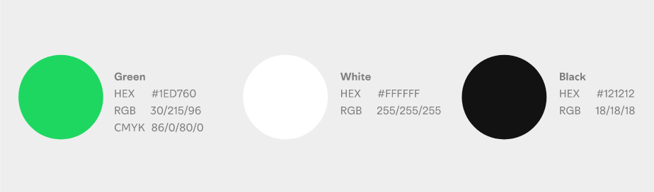

# GUÍA DE ESTILOS
*https://developer.spotify.com/documentation/design*

## TIPOGRAFÍAS

Por defecto esta plataforma suele usar Sans-Serif, sin embargo, tambien suelen variar sus estilos con:
- Helvetuca Neue
- Helvetuca
- Arial

## COLORES

La empresa suele utilizar 3 colores que acompañan todas sus interfaces y están tambien presentes en el logo:

El blanco se suele utilizar para todos los textos, siendo el verde una opcion mas para resaltar algunos contenidos. El fondo, por defecto, es negro.

## LOGOS

El logo de Spotify consta siempre de dos de los colores anteriormente mencionados: verde, blanco y negro. Oficialmente el logo de esta compañía sería la que está a continuación:

Estas son las versiones cortas del logo. La suelen utilizar cuando el tamaño de la venta es reducido. Este icono nunca desaparece, simplemente quitan el nombre de al lado.

