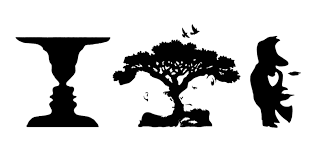

# DISEÑO DE INTERFACES WEB

Percepción, es el proceso de recogida y tratamiento de la información sensorial. 

**Psicología Gestalt:** Según esta teoría, la mente configura, a través de ciertas leyes, los elementos que le llegan a través de los canales sensoriales (percepción) o a través de la memoria (pensamiento, inteligencia y resolución de problemas).

## Elementos conceptuales

|