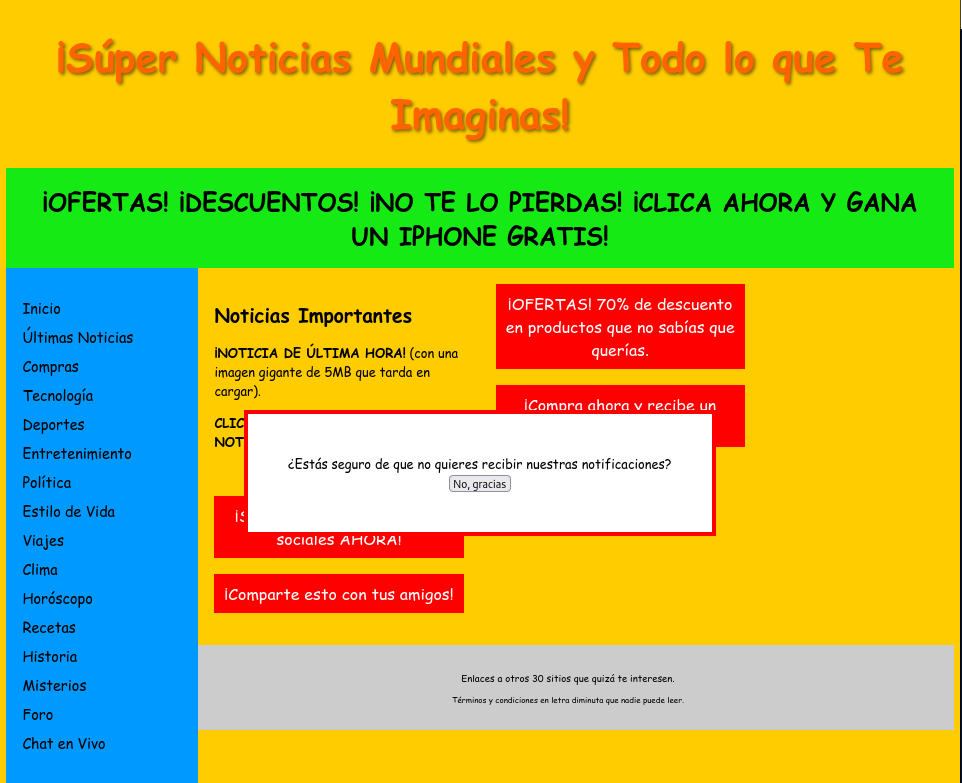

# PÁGINA SOBRESATURADA

Esta página presenta una gran variedad de errores que rompen con todo lo enseñado en esta materia y es poco accesible.

El primer erro que nos salta en la cara es una notificación que salta nada más abrir la pagina que nos pregunta si en enefecto, no queremos recibir notificaciones y con solo la posibilidad de afirmar que no.

Esto es ilógico y molesta en general a todos los usuarios que entran en la pagina.

## PAUTAS DESAFIADAS

Perceptible: las imagenes, botones, enlaces... no son adecuados, ni tienen un alt

Operable: Te obligan a aceptar los terminos de una ventana que no aclara nada del contenido, no te piden nada y es inutil

Comprensible: La estructura esta rota. Nada mas redimensionar la ventana, los tamaños rompen la estetica de la pagina. Te indican que puedes clickar en un lado y no puedes clickar en nada.

Robusto: No permite la lectura del propio navegador o de alguna herramienta de ayuda para poder leer el contenido gente con discapacidad visual... 