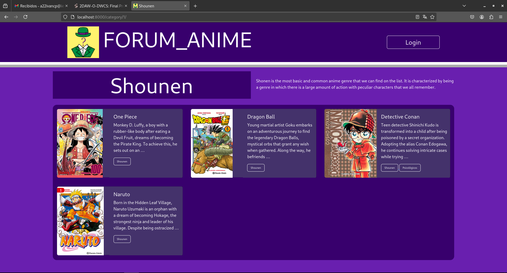
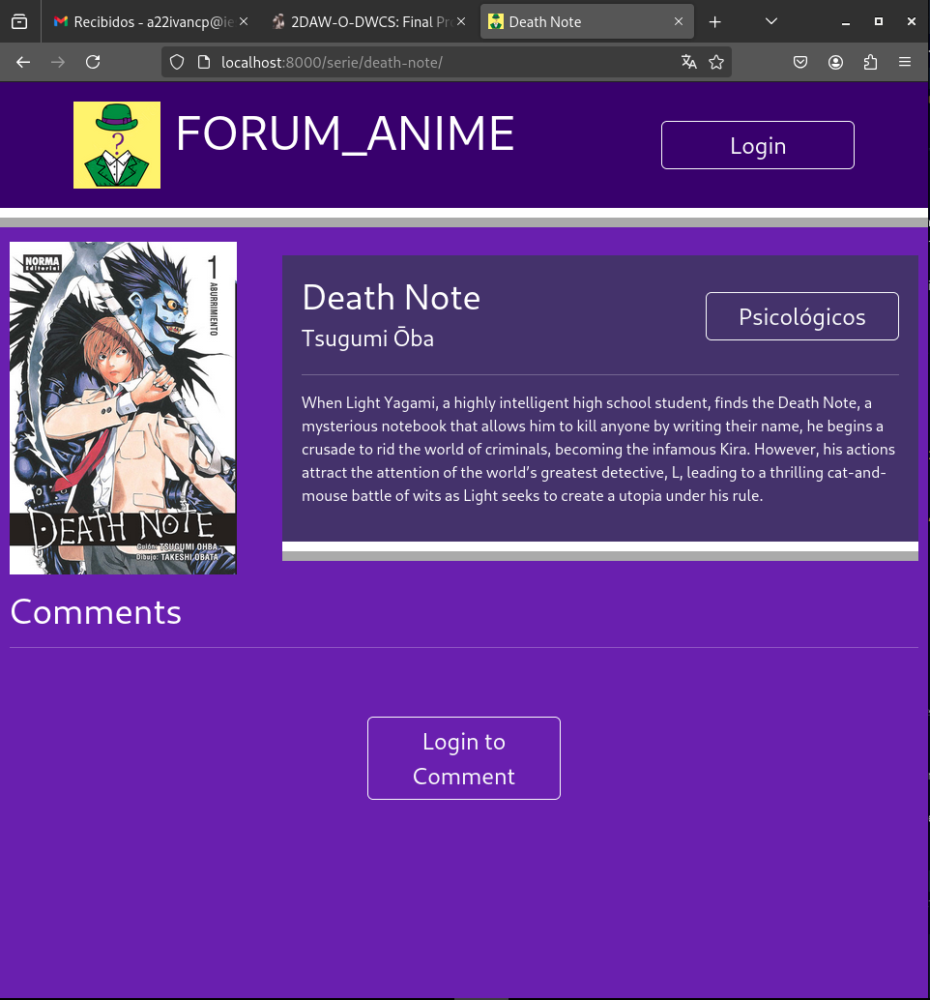
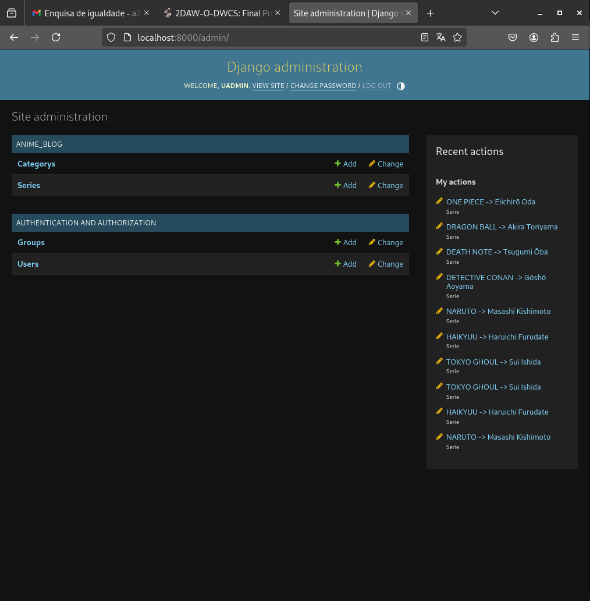

# FORUM_ANIME

Esta será una plataforma donde las personas podrán expresar sus opiniones sinceras sobre una serie. Así, quienes visiten la página podrán evaluar una serie basándose en el criterio de los usuarios que participan en el foro.  

Habrá un catálogo de series que irá creciendo progresivamente. Cada serie contará con una descripción, y los usuarios podrán opinar sobre ella a medida que pase el tiempo.  

El objetivo es que los usuarios puedan recibir recomendaciones de series y, al mismo tiempo, ayudar a otros con sus valoraciones.  

## DataBase


La base de datos constará de tres tablas: `Serie`, `Category` y `Comment`.  

Las `series` estarán categorizadas y podrán recibir comentarios de los usuarios. Además, incluirán información básica como título, descripción, imagen, autor, fecha de estreno y un *slug* autogenerado a partir del título.  

Los `comentarios` aprovecharán parte de la información de las sesiones para asociar el nombre de usuario y el correo electrónico. El único dato que el usuario deberá ingresar manualmente será el contenido del comentario; los demás campos se generarán automáticamente.  

Las `categorías` solo contendrán un nombre y una breve descripción para diferenciarlas entre sí.  


## Screens design


Todas las páginas (excepto la de sesión) comparten una cabecera con el logo y la información de sesión del sitio web.  

La página `home.html` muestra una breve descripción del sitio y, junto a ella, las categorías de series disponibles. En la parte inferior se encuentran las tres series más comentadas (o, en su defecto, las últimas series añadidas si aún no hay comentarios), con enlaces a sus respectivas páginas **serie_detail.html**.  

Si el usuario hace clic en una categoría, será redirigido a `category_series.html`, donde podrá ver la descripción de la categoría y la lista de series asociadas. Cada serie contará con un enlace a su página **serie_detail.html**.  

En la página `serie_detail.html`, se mostrará toda la información de la serie, incluyendo sus comentarios. Si el usuario tiene la sesión iniciada, podrá agregar un comentario a través de un formulario.  

La página `session.html` se abre al hacer clic en el botón de inicio de sesión (*login*). Al completar y enviar el formulario, se inicia la sesión del usuario, reemplazando el botón de *login* por un avatar y un botón para cerrar sesión. Mientras la sesión esté activa, el usuario podrá dejar comentarios.  


# Resultado

## Final structure

El proyecto cuenta con la siguiente estructura de archivos y directorios, organizada de manera modular para garantizar un desarrollo claro y escalable:
``` sh
.
├── anime_blog
│   ├── admin.py
│   ├── apps.py
│   ├── forms.py
│   ├── __init__.py
│   ├── migrations
│   │   ├── 0001_initial.py
│   │   ├── 0002_alter_serie_description.py
│   │   ├── 0003_comment.py
│   │   ├── __init__.py
│   │   └── __pycache__
│   │       ├── 0001_initial.cpython-311.pyc
│   │       ├── 0002_alter_serie_description.cpython-311.pyc
│   │       ├── 0003_comment.cpython-311.pyc
│   │       └── __init__.cpython-311.pyc
│   ├── models.py
│   ├── __pycache__
│   │   ├── admin.cpython-311.pyc
│   │   ├── apps.cpython-311.pyc
│   │   ├── forms.cpython-311.pyc
│   │   ├── __init__.cpython-311.pyc
│   │   ├── models.cpython-311.pyc
│   │   ├── urls.cpython-311.pyc
│   │   └── views.cpython-311.pyc
│   ├── static
│   │   ├── img
│   │   │   ├── enigma.png
│   │   │   ├── logo.png
│   │   │   └── salir.png
│   │   └── style.css
│   ├── templates
│   │   ├── base.html
│   │   ├── category_series.html
│   │   ├── home.html
│   │   ├── includes
│   │   │   ├── base_comment.html
│   │   │   └── base_serie.html
│   │   ├── login.html
│   │   └── serie_details.html
│   ├── tests.py
│   ├── urls.py
│   └── views.py
├── media
│   └── series
│       ├── deathNote.jpeg
│       ├── detectiveConan.jpg
│       ├── dragonBall.jpg
│       ├── haikyuu.jpg
│       ├── naruto.jpg
│       ├── onePiece.jpg
│       └── tokyoGhoul.jpg
├── my_project
│   ├── asgi.py
│   ├── __init__.py
│   ├── __pycache__
│   │   ├── __init__.cpython-311.pyc
│   │   ├── settings.cpython-311.pyc
│   │   ├── urls.cpython-311.pyc
│   │   └── wsgi.cpython-311.pyc
│   ├── settings.py
│   ├── urls.py
│   └── wsgi.py
├── db.sqlite3
├── docker-compose.yml
├── Dockerfile
├── manage.py
└── requirements.txt
```

<br/>

## Final View

### Página de Inicio

La página principal permite la navegación a las diferentes categorías y series disponibles.


Versión `responsive`:


### Categoria

Los usuarios pueden explorar series organizadas por categorías.


### Serie

Vista de una serie sin comentarios:


Vista con comentarios:


Formulario para agregar comentarios:


### Login

Interfaz para el acceso de usuarios registrados.


## AdminPanel

El proyecto incluye un panel de administración para gestionar el contenido de manera sencilla.


### Series
Listado de series en el panel de administración:


Detalles de una serie:


### Categorias

Listado de categorías:
{


Detalles de una categoría:

